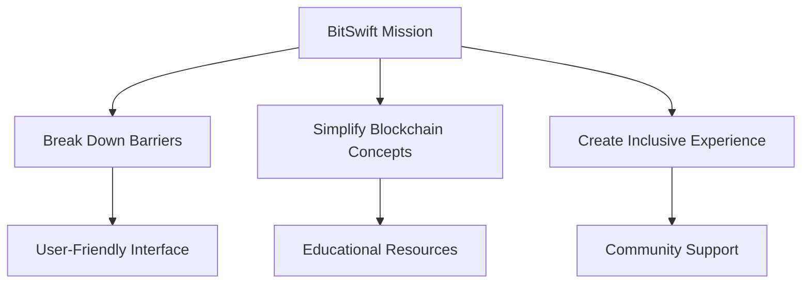
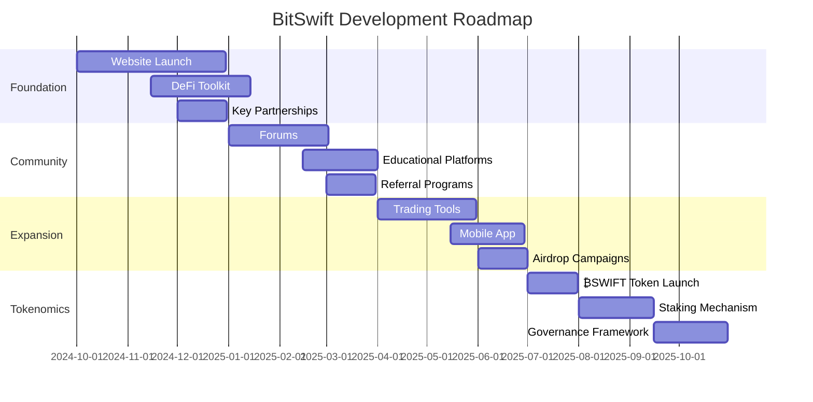

# ₿itSwift! ᗢ - Revolutionizing DeFi

  

## 🌟 Introduction to the Future of DeFi

  Welcome to ₿itSwift! ᗢ, where we're redefining the landscape of decentralized finance. Led by our visionary CEO, Commander 🎖️, we're on a mission to simplify DeFi and make it accessible to everyone.

## 💡 Our Mission: Democratizing DeFi

## 🦸♀️ Strategic Alliances

We've partnered with [scripters.shop](https://scripters.shop) to combine technical expertise with user-centric design.

  <strong>DeFi Ecosystem Comparison</strong>
  <table>
    <tr>
      <th>Feature</th>
      <th>BitSwift</th>
      <th>Uniswap</th>
      <th>Aave</th>
    </tr>
    <tr>
      <td>Ease of Use</td>
      <td>⭐⭐⭐⭐⭐</td>
      <td>⭐⭐⭐⭐</td>
      <td>⭐⭐⭐</td>
    </tr>
    <tr>
      <td>Innovation</td>
      <td>⭐⭐⭐⭐⭐</td>
      <td>⭐⭐⭐⭐</td>
      <td>⭐⭐⭐⭐</td>
    </tr>
    <tr>
      <td>Community Focus</td>
      <td>⭐⭐⭐⭐⭐</td>
      <td>⭐⭐⭐</td>
      <td>⭐⭐⭐⭐</td>
    </tr>
  </table>

## 🎨 Brand Identity: A Visual Journey

| Captivating Banner | Sleek Banner |
|:---:|:---:|
|  |  |

### Signature Elements

  
  
  

## 📱 Stay Connected, Stay Informed

- 🐙 GitHub: [@YourBitSwift](https://github.com/YourBitSwift)
- 📣 Telegram: [@BitSwiftOfficial](https://t.me/BitSwiftOfficial)
- 📢 [YourBitSwift](https://t.me/YourBitSwift) - Telegram Official Channel
  
## 💫 Leadership: Steering the DeFi Revolution

Commander 🎖️ leads with three core principles:

  

    <h3>🚀 Trailblazing Innovation</h3>
    
Embracing cutting-edge technologies

  

  

    <h3>🔓 Empowerment through Simplicity</h3>
    
Making complex ideas accessible

  

  

    <h3>🌐 Advancing Decentralization</h3>
    
Fostering financial freedom

  

## 🚀 Development Roadmap: A Journey of Continuous Growth

## 🚜 Getting on Board: Your First Steps

1. 💬 Join our Telegram community
2. 🔍 Explore our GitHub repository
3. 🛠️ Prepare for our upcoming toolkit release

---

  "Empowering the future of finance, one block at a time." - Commander 🎖️

