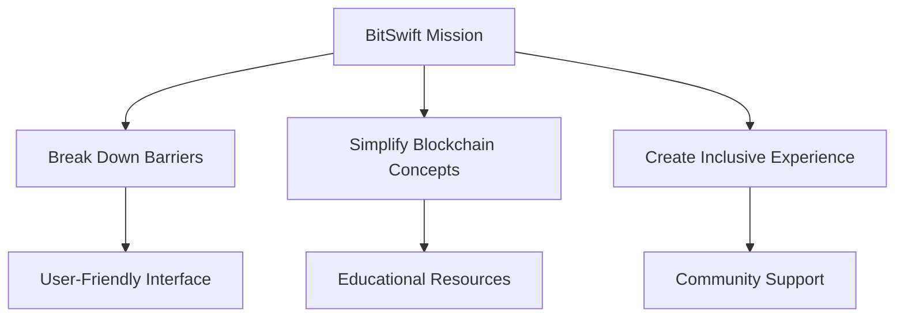
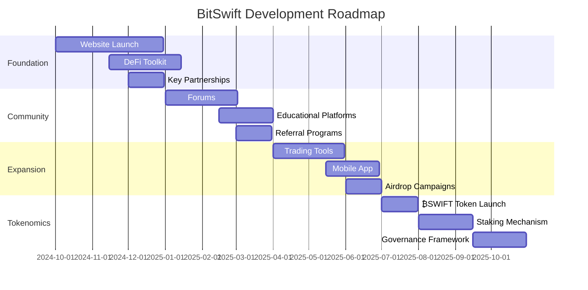

  

## 🌟 Introduction

Welcome to ₿itSwift! ᗢ, the future of decentralized finance. Led by our visionary CEO, Commander 🎖️, we're on a mission to democratize DeFi and make it accessible to everyone. BitSwift is not just another DeFi platform; it's a revolution in the making.

## 📚 Table of Contents

- [Our Mission](#-our-mission-democratizing-defi)
- [Strategic Alliances](#️-strategic-alliances)
- [Brand Identity](#-brand-identity-a-visual-journey)
- [Stay Connected](#-stay-connected-stay-informed)
- [Leadership](#-leadership-steering-the-defi-revolution)
- [Development Roadmap](#-development-roadmap-a-journey-of-continuous-growth)
- [Getting Started](#-getting-on-board-your-first-steps)
- [Features](#-features)
- [Installation](#-installation)
- [Usage](#-usage)
- [Contributing](#-contributing)
- [License](#-license)

## 💡 Our Mission: Democratizing DeFi

At BitSwift, we're committed to breaking down the barriers that have kept DeFi out of reach for many. Our mission is threefold:

1. **Break Down Barriers**: We're creating a user-friendly interface that makes DeFi accessible to everyone, regardless of their technical background.
2. **Simplify Blockchain Concepts**: Through comprehensive educational resources, we're demystifying the complex world of blockchain and DeFi.
3. **Create an Inclusive Experience**: Our community-driven approach ensures that everyone has a voice in the BitSwift ecosystem.

## 🦸♀️ Strategic Alliances

We've forged a powerful partnership with [scripters.shop](https://scripters.shop) to combine cutting-edge technical expertise with user-centric design. This collaboration allows us to deliver a DeFi experience that's both powerful and intuitive.

### DeFi Ecosystem Comparison

| Feature | BitSwift | Uniswap | Aave |
|---------|----------|---------|------|
| Ease of Use | ⭐⭐⭐⭐⭐ | ⭐⭐⭐⭐ | ⭐⭐⭐ |
| Innovation | ⭐⭐⭐⭐⭐ | ⭐⭐⭐⭐ | ⭐⭐⭐⭐ |
| Community Focus | ⭐⭐⭐⭐⭐ | ⭐⭐⭐ | ⭐⭐⭐⭐ |

## 🎨 Brand Identity: A Visual Journey

Our brand identity is a reflection of our commitment to innovation and accessibility in the DeFi space.

| Captivating Banner | Sleek Banner |
|:---:|:---:|
|  |  |

### Signature Elements

  

## 📱 Stay Connected, Stay Informed

Join our vibrant community and stay up-to-date with the latest BitSwift developments:

- 🐙 GitHub: [@YourBitSwift](https://github.com/YourBitSwift)
- 📣 Telegram: [@BitSwiftOfficial](https://t.me/BitSwiftOfficial)
- 📢 [YourBitSwift](https://t.me/YourBitSwift) - Telegram Official Channel

## 💫 Leadership: Steering the DeFi Revolution

Commander 🎖️, our visionary leader, guides BitSwift with three core principles:

1. 🚀 **Trailblazing Innovation**: Embracing cutting-edge technologies to stay at the forefront of DeFi.
2. 🔓 **Empowerment through Simplicity**: Making complex ideas accessible to empower users of all backgrounds.
3. 🌐 **Advancing Decentralization**: Fostering financial freedom through decentralized solutions.

## 🚀 Development Roadmap: A Journey of Continuous Growth

Our ambitious roadmap outlines the key milestones in BitSwift's journey:

## 🚜 Getting on Board: Your First Steps

1. 💬 Join our Telegram community
2. 🔍 Explore our GitHub repository
3. 🛠️ Prepare for our upcoming toolkit release

## 🌟 Features

- User-friendly interface for seamless DeFi interactions
- Educational resources to help users understand blockchain and DeFi concepts
- Community-driven development and governance
- Innovative trading tools and mobile app (coming soon)
- ₿SWIFT token for platform utility and governance (upcoming)

## 🛠 Installation

*Coming soon: Instructions for installing and setting up BitSwift tools and applications.*

## 🖥 Usage

*Coming soon: Detailed guides on how to use BitSwift's features and participate in the ecosystem.*

## 🤝 Contributing

We welcome contributions from the community! If you'd like to contribute to BitSwift, please follow these steps:

1. Fork the repository
2. Create a new branch (`git checkout -b feature/AmazingFeature`)
3. Commit your changes (`git commit -m 'Add some AmazingFeature'`)
4. Push to the branch (`git push origin feature/AmazingFeature`)
5. Open a Pull Request

For more information on contributing, please see our [Contribution Guidelines](CONTRIBUTING.md).

## 📄 License

*Coming soon: Information about the project's license.*

---

  "Empowering the future of finance, one block at a time." - Commander 🎖️

